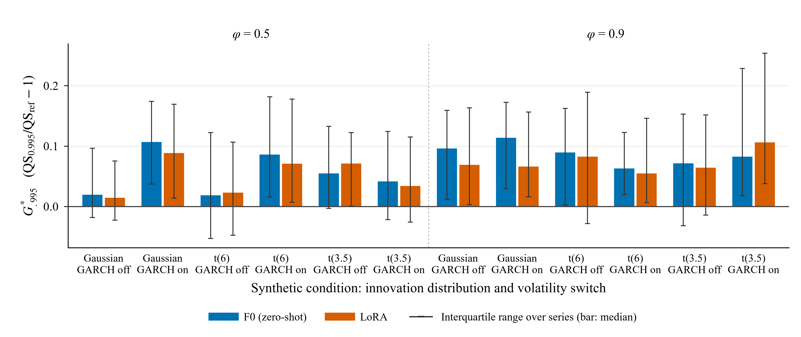
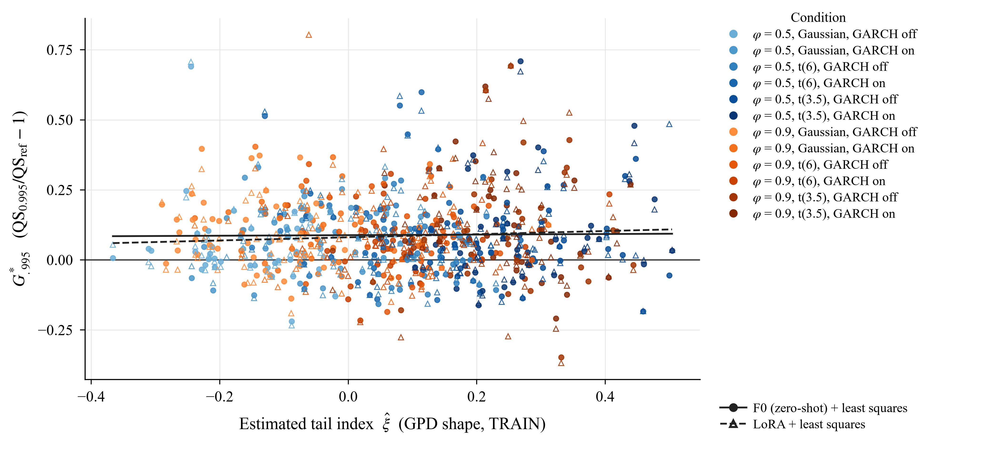
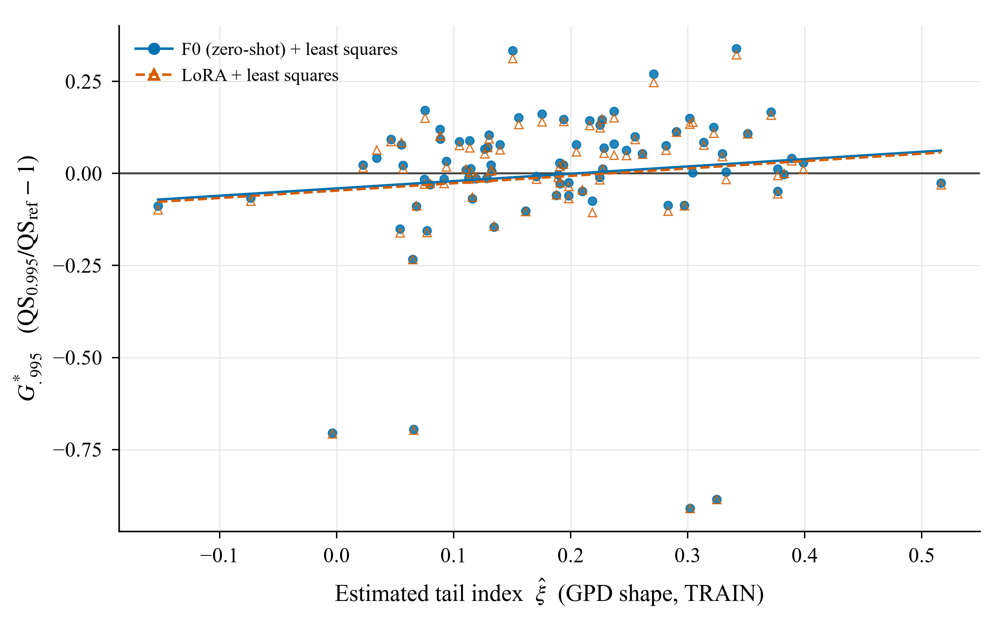
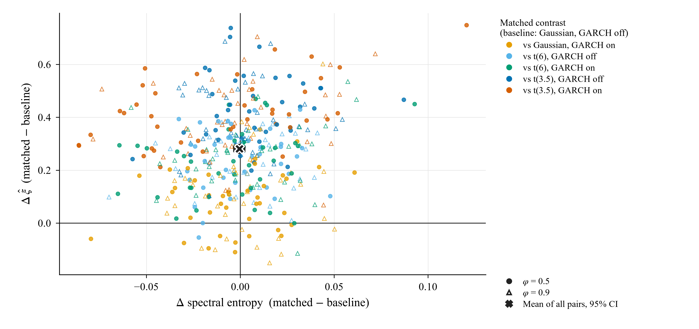

# 꼬리 복잡도 타당성 검증 TCV-1 — 보고서

## 1. 판정

`TC_UNSTABLE` — H1 실패. 추정량이 불안정해 난이도 지표로 쓸 수 없다.

판정 근거: 판정 순서상 먼저 걸린 것은 S2의 H1 실패다(반분 신뢰도 ξ 0.056, θ 0.076, 기준 0.5). 실패한 가설은 S1 H3, H4, H5 / S2 H1, H3, H5.

추가로, 난이도 추정이 안정적인 합성 자료(S1)에서도 H3(증분 설명력)와 H5(실익)가 실패했다. S1의 ΔR²는 0.011(F0)·0.015(LoRA)로 기준 0.10에 크게 못 미치고, 상위 삼분위의 G*_.995 중앙값은 0.072(F0)·0.068(LoRA)로 기준 0.10 미만이다. 즉 이 결과는 "꼬리 난이도를 금융에서 재도 흔들린다"에서 그치지 않고, "재도 잘 재지는 합성에서조차 그 축이 격차를 설명하지 못하고 격차 자체가 크지 않다"까지 말한다. 방법 단계(조건부 EVT 헤드)로 갈 근거는 이 실험에 없다.

(판정 코드가 남긴 문자열: H1 failed (S1=H3, S2=H1))

[확인] 이 보고서의 모든 수치는 저장된 CSV/JSON에서 자동 계산됐다. 독립 재계산 최대 차이 0.000000000000 (기준 1e-9, PASS).

## 2. 계획자 전제 중 틀린 것

- [확인] 계약 안에 충돌이 있다. §0 34행은 "H1 실패 → TC_UNSTABLE", §7 205행은 "S1만 통과면 TC_SYNTH_ONLY"라고 적어, S1이 전부 통과하고 S2가 H1에서 실패하는 조합에서 두 규칙이 서로 다른 토큰을 가리킨다. 이번 결과는 S1도 H3에서 실패해 그 조합이 아니므로 이 충돌은 판정에 영향을 주지 않았다. 다음 계약에서는 정리해야 한다.
- [확인] 실행 환경이 계약 §1의 기록과 다르다. 계약은 Ubuntu 22.04 · RTX 3080 10GB · torch 2.8.0을 적었지만 실제는 Windows-10-10.0.26200-SP0 · NVIDIA GeForce RTX 4070 12.0GB · torch 2.10.0+cu128다. 시간·VRAM 수치는 계약의 환경과 비교할 수 없다.
- [확인] Q7(arch 패키지)은 설치돼 있지 않았다. S2의 GARCH-t·조건부 EVT 참조를 위해 이번 실행에서 arch 8.0.0을 설치했다(사용자 승인).
- [확인] Q6의 "공개 경로"가 구체적이지 않았다. yfinance·pandas-datareader는 미설치이고 stooq는 자바스크립트 검증으로 막혔다. Yahoo chart API를 직접 호출해 수정주가를 받았고, 목록·종목별 응답 해시를 기록했다.
- [확인] Q5(Time-PEFT의 스펙트럼 엔트로피 정확한 정의)는 확인하지 못했다. OpenReview가 브라우저 검증으로 막혀 본문을 읽지 못했고, 계약 §2의 대체 규칙대로 표준 정규화 스펙트럼 엔트로피를 썼다. 그래서 "Time-PEFT 축과 독립"이라는 H2 주장은 그만큼 약하다.
- [확인] Q1·Q2·Q3·Q4·Q8은 계약대로 성립했다. 특히 격자 밖 요청은 실제로 0.99 값을 돌려준다(2.658296 = 0.995 = 0.999).
- [확인] 계약 §4.2의 "결측 5% 미만"은 거래일 커버리지 기준이 없으면 상장이 늦은 종목을 걸러내지 못한다. 거래일 커버리지 95% 기준을 적용해 101개 중 84개를 적격으로 했다.

## 3. S0 도구 검증

| 검사 | 결과 | 수치 |
| --- | --- | --- |
| S0a 격자 밖 = 0.99 값 | PASS | {'0.95': 1.6088900566101074, '0.99': 2.6582961082458496, '0.995': 2.6582961082458496, '0.999': 2.6582961082458496} |
| S0b 추정량 단위 테스트 | PASS | GPD xi=0.217, ARMAX(0.5) theta=0.495, iid theta=1.000 |
| S0c 오라클 초과율(0.99) | PASS | 조건별 0.0074–0.0119 (기준 0.006–0.014) |
| S0d 분위수 점수 | PASS | 손계산 3건 일치 |
| S0e 데이터 스냅샷 | PASS | 적격 84종목, 목록 해시 355d574ab2ec |
| S0f 누설 감사 | PASS | 난이도·EVT-S·SEL·GARCH 모두 해당 시점 이전 자료만 사용(설계와 인덱스로 확인) |

## 4. H1–H5

| 가설 | S1 합성 수치 | S1 | S2 금융 수치 | S2 |
| --- | --- | --- | --- | --- |
| H1 measurability | S1 rho(xi)=0.814, rho(theta)=0.725 (>= 0.8/0.6) | PASS | S2 split-half xi=0.056, theta=0.076 (>= 0.5) | FAIL |
| H2 non-redundancy | mean dSE=-0.0004 [-0.0034, 0.0025], mean dxi=0.2808 [0.2643, 0.2971] | PASS | rho(SE,xi)=0.043, rho(SE,1-theta)=0.034 (|rho| < 0.3) | PASS |
| H3 predictive (F0) | xi=-0.008 [-0.079, 0.065], dR2=0.011 [0.001, 0.040] | FAIL | xi=0.020 [-0.982, 0.845], dR2=0.000 [0.000, 0.141] | FAIL |
| H3 predictive (LORA) | xi=0.035 [-0.038, 0.111], dR2=0.015 [0.002, 0.046] | FAIL | xi=0.023 [-0.984, 0.857], dR2=0.000 [0.000, 0.141] | FAIL |
| H4 mechanism (F0) | xi(.995)-xi(.95)=-0.003 [-0.073, 0.066] | FAIL | 0.177 [0.022, 0.359] | PASS |
| H5 practical size (F0) | top=0.072, bottom=0.044 (>= 0.10 / <= 0.05) | FAIL | top=0.035, bottom=0.009 | FAIL |
| H5 practical size (LORA) | top=0.068, bottom=0.047 (>= 0.10 / <= 0.05) | FAIL | top=0.040, bottom=0.008 | FAIL |

판정 순서는 계약 §7대로 H1 → H5이며, 앞 가설이 실패하면 뒤 결과는 보고만 한다.

## 5. 회귀 (M0: SE / M1: SE + xi + (1-theta))

| 모형 | n | R2(M0) | R2(M1) | dR2 | dR2 CI | SE 계수 | xi 계수 | (1-theta) 계수 |
| --- | --- | --- | --- | --- | --- | --- | --- | --- |
| S1_F0_tau0.95 | 480 | 0.027 | 0.038 | 0.011 | [0.001, 0.040] | -0.203 [-0.312, -0.102] | -0.005 [-0.028, 0.017] | 0.032 [0.004, 0.058] |
| S1_F0_tau0.995 | 480 | 0.002 | 0.012 | 0.011 | [0.001, 0.040] | -0.144 [-0.433, 0.140] | -0.008 [-0.079, 0.065] | 0.087 [0.008, 0.164] |
| S1_F0_tau0.995_true | 480 | 0.002 | 0.012 | 0.010 | [0.001, 0.038] | -0.136 [-0.422, 0.141] | 0.003 [-0.083, 0.091] | 0.081 [0.002, 0.158] |
| S1_LORA_tau0.95 | 480 | 0.009 | 0.021 | 0.012 | [0.001, 0.043] | -0.113 [-0.212, -0.013] | -0.002 [-0.024, 0.021] | 0.032 [0.003, 0.058] |
| S1_LORA_tau0.995 | 480 | 0.004 | 0.018 | 0.015 | [0.002, 0.046] | -0.222 [-0.514, 0.091] | 0.035 [-0.038, 0.111] | 0.091 [0.013, 0.171] |
| S1_LORA_tau0.995_true | 480 | 0.004 | 0.016 | 0.013 | [0.002, 0.041] | -0.197 [-0.487, 0.109] | 0.054 [-0.032, 0.143] | 0.070 [-0.011, 0.149] |
| S2_F0_tau0.95 | 84 | 0.006 | 0.009 | 0.003 | [0.000, 0.110] | 13.929 [-18.755, 59.413] | -0.157 [-1.155, 0.669] | 0.098 [-0.172, 0.387] |
| S2_F0_tau0.995 | 84 | 0.003 | 0.003 | 0.000 | [0.000, 0.141] | 10.189 [-23.015, 56.926] | 0.020 [-0.982, 0.845] | 0.018 [-0.282, 0.353] |
| S2_LORA_tau0.95 | 84 | 0.006 | 0.009 | 0.003 | [0.000, 0.109] | 13.995 [-18.734, 59.547] | -0.156 [-1.150, 0.670] | 0.098 [-0.172, 0.387] |
| S2_LORA_tau0.995 | 84 | 0.004 | 0.004 | 0.000 | [0.000, 0.141] | 10.698 [-22.179, 57.879] | 0.023 [-0.984, 0.857] | 0.016 [-0.274, 0.348] |

[확인] 불일치: S2_F0_tau0.995, S2_LORA_tau0.995 에서 dR2 점추정이 부트스트랩 CI 하한보다 작다. dR2는 0 이상으로만 나오는 통계량이라 재표본에서 체계적으로 부풀고, 표본이 작고 신호가 약하면 관측값이 재표본 분포의 2.5% 아래로 내려갈 수 있다. 판정 기준(dR2 >= 0.10)은 점추정·CI 어느 쪽으로 읽어도 미달이라 결론은 바뀌지 않지만, 이 CI는 그대로 인용하면 안 된다.

## 6. 변동성 추적 실패와 꼬리 실패의 구분 (계약 §11 첫째)

| 자료 | arm | G_.9 중앙값 | G_.95 중앙값 | G*_.995 중앙값(SEL) | G_.995 중앙값(CLAMP) |
| --- | --- | --- | --- | --- | --- |
| S1 | F0 | 0.032 | 0.035 | 0.071 | 0.112 |
| S1 | LORA | 0.026 | 0.028 | 0.062 | 0.158 |
| S2 | F0 | -0.006 | -0.006 | 0.023 | 0.112 |
| S2 | LORA | -0.009 | -0.009 | 0.014 | 0.120 |

G_.9가 이미 크면 격차의 원인이 꼬리가 아니라 조건부 척도(변동성) 추적 실패일 수 있다. H4는 그 구분을 위한 검사다.

## 7. 하지 않은 것, 이탈, 자원

- 새 PEFT 모듈(조건부 EVT 헤드 등)은 만들지도 학습하지도 않았다(계약 §10).
- S3(전력가격)는 이번 계약대로 실행하지 않았다.
- LoRA 학습은 12 (S1) + 2 (S2) = 14 fits로 예산 14를 지켰다. 학습 시간 합계 46분, 학습 peak VRAM 1.65 GiB.
- 이탈: (1) arch 설치 (2) Yahoo chart API 직접 호출 (3) 적격 기준에 거래일 커버리지 95% 추가 (4) 스펙트럼 엔트로피는 계약 §2의 대체 정의 사용 (5) S2 참조 계산과 S1 학습을 같은 PC에서 병행(CPU/GPU 분리).
- 생존 편향: 현재 S&P 100 구성종목만 썼다. 퇴출 종목이 빠져 난이도 범위가 좁아지고 H3 검정력이 낮아지는 방향이다.
- 0.999는 계열당 초과가 0.2~1.6개 수준이라 보조 지표로만 썼다.
- 봉인: SEAL.json 2026-09-24 17:19:38 (S1 digest 839e0b60fbb8, S2 digest e5103462fa77). TEST 채점은 봉인 뒤에만 수행했고, 채점 스크립트는 봉인 해시가 다르면 실행을 거부한다.
- 독립 재계산: VERIFY_RECOMPUTE.json 최대 차이 0.000000000000.

## 8. 산출물

[전제 감사](PREMISE_AUDIT.json) · [S0](S0_REPORT.json) · [봉인](SEAL.json) · [S1 난이도](S1_DIFFICULTY.csv) · [S1 점수](S1_SCORES.csv) · [S1 가설](S1_HYPOTHESES.json) · [S1 쌍](S1_PAIRS.csv) · [S2 난이도](S2_DIFFICULTY.csv) · [S2 점수](S2_SCORES.csv) · [S2 가설](S2_HYPOTHESES.json) · [S2 신뢰도](S2_RELIABILITY.csv) · [회귀](REGRESSIONS.json) · [재계산](VERIFY_RECOMPUTE.json) · [그림 값](FIGURE_VALUES.csv) · [캡션](CAPTIONS.md)

