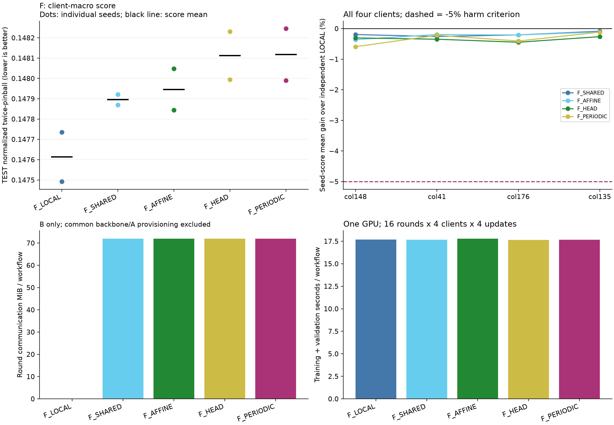

# F REPORT_KO

이번 후보는 ‘원자료를 서버에 보내지 않는 시뮬레이션에서 주기 개인화가 독립 LoRA·공유 적응·단순 개인화보다 유용한가’를 Electricity 개발 화면에서 시험했다. V로 선택한 직접 기준선은 seed92201 `F_LOCAL`, seed92202 `F_LOCAL`이며 후보의 TEST 개선율은 각각 -0.338%, -0.346%, 평균 점수 기준 -0.342%이다. 비용 조건은 7 private params/client이며 median nMAE 변화는 기준선보다 +0.326%이다(양수는 손해). 독립 LOCAL이 선택 기준선으로 남았고, 주기 개인화는 공유 적응 및 단순 개인화보다 추가 가치를 보이지 않았다. 판정은 **NO_GO_CURRENT**이며, 현재 네 client와 고정 예산에서는 주기 개인화 후보의 후속 투자 근거가 없다. 신규성·논문 PASS는 판정하지 않았다.

## 전체 비교 결과

점수는 두 seed 점수의 평균이다. 예측 ensemble이 아니다. A0/N0는 고정 pretrained baseline이다.

| Method | Pinball | nMAE | nRMSE | Coverage80 | Width80 | RawCrossing | RawMAE |
| --- | --- | --- | --- | --- | --- | --- | --- |
| F_LOCAL | 0.147614 | 0.185633 | 0.275469 | 0.804112 | 0.579962 | 0.000024 | 107.703297 |
| F_SHARED | 0.147896 | 0.185986 | 0.275927 | 0.801284 | 0.576204 | 0.000035 | 107.863139 |
| F_AFFINE | 0.147946 | 0.186027 | 0.275978 | 0.800276 | 0.575121 | 0.000035 | 107.916127 |
| F_HEAD | 0.148112 | 0.186259 | 0.276236 | 0.800393 | 0.576181 | 0.000031 | 108.032614 |
| F_PERIODIC | 0.148118 | 0.186238 | 0.276194 | 0.799018 | 0.575118 | 0.000035 | 107.984687 |

주 비교의 paired 14일 block bootstrap 95% CI는 **[-0.521%, -0.184%]**이다. 6시간 간격 TEST 원점 866개를 56개씩 묶어 2,000회 재표집하고 모든 계열·두 seed를 함께 보존했다. overlapping target을 독립 표본으로 세지 않았다. CI는 고정된 두 seed와 계열에 조건부이며 optimizer population과 새 자료 일반화를 보장하지 않는다.

[모든 seed 점수](../scores.csv) · [계열 점수](../series_scores.csv) · [seed별/평균 효과와 CI](../seed_effects.csv) · [자원 표](../resource_table.csv)

## 선택과 구현

V 선택 checkpoint다. Q/T 단위는 update, F는 round이며 0은 학습 전 초기값이다.

| Method | Seed92201 | Seed92202 |
| --- | --- | --- |
| F_LOCAL | 16 | 16 |
| F_SHARED | 16 | 16 |
| F_AFFINE | 16 | 8 |
| F_HEAD | 16 | 16 |
| F_PERIODIC | 16 | 8 |

새 프로세스 추론 실측이다. latency는 각 seed 프로세스의 20회 median을 평균했으며 VRAM은 두 seed 중 큰 값이다. Fit seconds는 학습·검증 구간 평균으로 초기화와 별도 감사 비용을 포함한 전체 작업 시간이 아니다.

| Method | Artifact MiB | Batch1 ms | Batch8 ms | Allocated MiB (B8) | Reserved MiB (B8) | Fit seconds |
| --- | --- | --- | --- | --- | --- | --- |
| F_LOCAL | 95.63 | 17.10 | 17.14 | 106.79 | 138.00 | 17.70 |
| F_SHARED | 91.61 | 17.46 | 17.68 | 106.79 | 138.00 | 17.66 |
| F_AFFINE | 91.61 | 17.38 | 18.21 | 106.79 | 136.00 | 17.80 |
| F_HEAD | 91.61 | 17.92 | 18.67 | 106.79 | 136.00 | 17.64 |
| F_PERIODIC | 91.61 | 18.24 | 18.90 | 106.79 | 136.00 | 17.67 |

선택한16개 열의 처음4개(col148/41/176/135)를 client로 사용했다. 각 client는 자기 값·scale로만 학습한다. 공유 FFA는 seed별 같은 A를 고정하고 B만 학습·equal-client 평균했다. LOCAL은 양쪽 factor를 학습하므로 trainable count가 다르며 INITIAL_AUDIT에 공개했다.

16 rounds ×4 clients ×4 local updates, client당64 updates다. 공유 optimizer는 round마다 reset, private optimizer state는 client에 유지했다. 실제 업로드 key는 B뿐이고, mean(B)A=mean(BA)를 NumPy 산술과 함께 검산했다. 서버 V 선택에는 네 scalar만 반환했다. public series의 소프트웨어 시뮬레이션이며 실제4회사·DP·규제 준수 실험이 아니다.

AFFINE2개, HEAD128개, PERIODIC7개의 private coefficient를 같은 lr1e-3으로 학습했다. 주기24/168은 hourly slot 가설이며 weekday label이 아니다. [모든 client의 LOCAL/SHARED 대비 손익](../F_client_effects.csv)과 [validation-fixed tail](../F_validation_fixed_tail.csv)을 공개했다. TEST worst-client를 선택 과정에 사용하지 않았다.

두 seed 점수를 평균한 client별 primary다. 마지막 열은 TEST의 기술 통계이며 선택에 사용하지 않았다.

| Method | col148 | col41 | col176 | col135 | Client mean | TEST worst |
| --- | --- | --- | --- | --- | --- | --- |
| F_LOCAL | 0.166346 | 0.168054 | 0.128362 | 0.127693 | 0.147614 | 0.168054 |
| F_SHARED | 0.166667 | 0.168487 | 0.128627 | 0.127801 | 0.147896 | 0.168487 |
| F_AFFINE | 0.166947 | 0.168377 | 0.128628 | 0.127832 | 0.147946 | 0.168377 |
| F_HEAD | 0.166852 | 0.168637 | 0.128933 | 0.128028 | 0.148112 | 0.168637 |
| F_PERIODIC | 0.167331 | 0.168420 | 0.128882 | 0.127838 | 0.148118 | 0.168420 |

계약의 보수적 client 위험 검사에서 확인한 최대 LOCAL 대비 손해는 0.782%다. 추론 latency/VRAM은 client0 대표 입력이고, 모든 client의 학습 wall/peak·저장·통신은 FIT에 별도 기록했다. 자원표의 adapter bytes는 네 client 전체 workflow 상태이며 한 client의 배포 크기라고 해석하지 않는다.

F smoke 최초 AFFINE1 update 뒤 동결 hash 검사가 실패했다. PEFT disable_adapter 복원이 고정 A의 requires_grad를 켠 것이 원인이었고, optimizer0 재현으로 tensor 값 변화 없이 mask/hash가 바뀜을 확인했다. mask 복원 후 남은5 smoke updates 안에서 검증을 마쳤다. 실패1회도24회 상한에 포함하며 F main 이전 문제였다. 수정 전 source와 장부를 보존했고 main 재학습은 없었다.

## 판정 범위와 검산

수치 판정은 `NO_GO_CURRENT`, 최종 해석은 `NO_GO_CURRENT`이다. 검증이 마지막 checkpoint까지 계속 개선하는 경우의 flag는 `False`이며 자동 연장하지 않았다. FFA-LoRA·개인화 FL·Fourier 보정과 인접하므로 한 데이터·두 seed의 결과를 최초 방법론이나 논문 PASS로 바꾸지 않는다.

학습의 frozen hash는 가중치와 persistent buffer를 포함한다. nonpersistent quantiles metadata의 학습 전후 hash는 수집하지 않았으며 Q 배포 roundtrip의 buffer/공식 예측 검사를 별도 수행했다. [검산 범위](../VERIFICATION.json), [실행 무결성 설명](../../../experiments/tsfm_peft_three_candidate_gonogo_20260922/DECISION_DETAILS.md), [source·cache manifest](../MANIFEST.json)를 함께 확인해야 한다.

GitHub에는 코드·표·그림·hash를 남겼고 raw data, HF weights, checkpoint, 전체 예측 cache는 제외했다. 수치 재생에는 로컬 cache 또는 동일 계약의 재실행이 필요하다. 추가 seed/LR/rank/bit-width/dataset/자동 v2는 실행하지 않는다.
