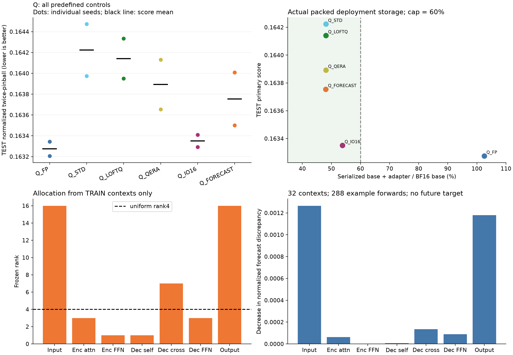

# Q REPORT_KO

이번 후보는 ‘실제 4bit 저장 제약에서 forecast sensitivity rank 배치가 좋은 초기화와 단순 mixed precision보다 미래 예측을 개선하는가’를 Electricity 개발 화면에서 시험했다. V로 선택한 직접 기준선은 seed92201 `Q_IO16`, seed92202 `Q_IO16`이며 후보의 TEST 개선율은 각각 -0.367%, -0.127%, 평균 점수 기준 -0.247%이다. 비용 조건은 48.08% BF16 bytes이며 median nMAE 변화는 기준선보다 +0.253%이다(양수는 손해). Q_IO16은 BF16 base의 53.79% 저장량으로 Q_FP 대비 primary 점수 손해가 약 0.05%여서 이번 압축 목적을 충족했다. Q_FORECAST는 48.08%로 더 작지만 추가 예측 개선은 없었다. QERA 계열은 balanced-factor 로컬 변형이라는 구현 범위를 적용한다. 판정은 **GO_STANDARD_ONLY**이며, 현재 forecast rank 배치 후보에 대한 후속 투자 근거는 확보되지 않았다. 신규성·논문 PASS는 판정하지 않았다.

## 전체 비교 결과

점수는 두 seed 점수의 평균이다. 예측 ensemble이 아니다. A0/N0는 고정 pretrained baseline이다.

| Method | Pinball | nMAE | nRMSE | Coverage80 | Width80 | RawCrossing | RawMAE |
| --- | --- | --- | --- | --- | --- | --- | --- |
| Q_FP | 0.163275 | 0.204580 | 0.305925 | 0.793300 | 0.620987 | 0.000205 | 72.128342 |
| Q_STD | 0.164223 | 0.205525 | 0.306700 | 0.783984 | 0.621478 | 0.044739 | 72.459321 |
| Q_LOFTQ | 0.164141 | 0.205383 | 0.306357 | 0.782612 | 0.616102 | 0.050159 | 72.435075 |
| Q_QERA | 0.163893 | 0.205238 | 0.306185 | 0.784591 | 0.618952 | 0.034085 | 72.385237 |
| Q_IO16 | 0.163351 | 0.204661 | 0.305939 | 0.793701 | 0.623403 | 0.000268 | 72.162519 |
| Q_FORECAST | 0.163754 | 0.205178 | 0.306242 | 0.792489 | 0.623967 | 0.021514 | 72.361680 |

주 비교의 paired 14일 block bootstrap 95% CI는 **[-0.422%, -0.173%]**이다. 6시간 간격 TEST 원점 866개를 56개씩 묶어 2,000회 재표집하고 모든 계열·두 seed를 함께 보존했다. overlapping target을 독립 표본으로 세지 않았다. CI는 고정된 두 seed와 계열에 조건부이며 optimizer population과 새 자료 일반화를 보장하지 않는다.

[모든 seed 점수](../scores.csv) · [계열 점수](../series_scores.csv) · [seed별/평균 효과와 CI](../seed_effects.csv) · [자원 표](../resource_table.csv)

## 선택과 구현

V 선택 checkpoint다. Q/T 단위는 update, F는 round이며 0은 학습 전 초기값이다.

| Method | Seed92201 | Seed92202 |
| --- | --- | --- |
| Q_FP | 256 | 128 |
| Q_STD | 256 | 256 |
| Q_LOFTQ | 256 | 256 |
| Q_QERA | 256 | 256 |
| Q_IO16 | 256 | 128 |
| Q_FORECAST | 128 | 256 |

새 프로세스 추론 실측이다. latency는 각 seed 프로세스의 20회 median을 평균했으며 VRAM은 두 seed 중 큰 값이다. Fit seconds는 학습·검증 구간 평균으로 초기화와 별도 감사 비용을 포함한 전체 작업 시간이 아니다.

| Method | Artifact MiB | Batch1 ms | Batch8 ms | Allocated MiB (B8) | Reserved MiB (B8) | Fit seconds |
| --- | --- | --- | --- | --- | --- | --- |
| Q_FP | 93.34 | 25.88 | 25.17 | 109.18 | 140.00 | 38.38 |
| Q_STD | 43.81 | 35.39 | 34.42 | 60.67 | 70.00 | 50.17 |
| Q_LOFTQ | 43.81 | 33.92 | 33.04 | 60.67 | 70.00 | 50.04 |
| Q_QERA | 43.81 | 32.51 | 34.65 | 60.67 | 70.00 | 49.57 |
| Q_IO16 | 48.97 | 31.81 | 32.27 | 65.82 | 76.00 | 49.44 |
| Q_FORECAST | 43.77 | 33.20 | 33.44 | 60.63 | 70.00 | 49.51 |

Chronos-Bolt-small의 eligible linear 102개 전체를 사용했다. NF4는 실제90개 linear를 packed uint8로 저장하고 backend 기본 고정밀 예외12개를 유지했다. IO16은 경계6개를 추가 BF16으로 유지하므로84개를 양자화했다. uniform rank4는 586,496개, Q_FORECAST는 576,512개 trainable parameter로 미사용 예산 1.702%다. rank map은 TEST 전에 봉인했다.

LoftQ는 HF 공식 one-step replacement이며 전체 iterative LoftQ가 아니다. QERA-diag는 공식 residual×RMS-scale SVD 수식과 동일 packed matrix에서 수치 대조했다. factor product 최대 차이는 2.98e-08였지만, 전체 QERA 논문 재현이라고 부르지 않는다. activation RMS는 동일 TRAIN-only32 contexts로 계산했다. sensitivity는 미래 y를 읽지 않고 최대288 example forwards를 사용했다.

**QERA 구현 범위:** 공식 코드의 docstring은 sqrt(S)를 A/B에 나누지만 실제 helper 본문은 B=U*S, A=Vh*D^-1이다. 이번 구현은 B=U*sqrt(S), A=sqrt(S)*Vh*D^-1인 balanced-factor 로컬 변형이다. 초기 product 일치는 factor별 초기값/최적화 동치를 뜻하지 않는다. Q_QERA·Q_IO16·Q_FORECAST에 동일 변형을 사용했으며, 이 차이는 학습 후 TEST 채점 전에 확인해 [별도 감사](../QERA_FACTOR_BALANCE_AUDIT.json)에 남겼다. 정확한 공식 QERA보다 우월하다고 해석할 수 없고, 새 학습으로 교체하지 않았다.

저장량은 직렬화된 packed weights·scales/metadata·고정밀 예외·config·선택 adapter를 합산했다. 기준 분모는 BF16 pretrained base이고 60% cap은 프로젝트의 운영 제약이다. 새 프로세스에서 실제 packed artifact를 읽어 batch1/8을 측정했으며 배포 파일의 공식/native 예측 parity도 검사했다. 4bit가 자동으로 빠르다고 가정하지 않았다.

원래 각 fit 초기화 타이밍이 별도로 계측되지 않아 같은 고정 초기화의 runtime-only 재생 결과를 resources/*_initialization.json에 별도로 저장했다. optimizer와 sensitivity probe를 추가하지 않았으며 원래 학습의 직접 계측값으로 표기하지 않는다.

## 판정 범위와 검산

수치 판정은 `NO_GO_CURRENT`, 최종 해석은 `GO_STANDARD_ONLY`이다. 검증이 마지막 checkpoint까지 계속 개선하는 경우의 flag는 `False`이며 자동 연장하지 않았다. QLoRA·LoftQ·QERA·TQS/rank allocation과 인접하므로 한 데이터·두 seed의 결과를 최초 방법론이나 논문 PASS로 바꾸지 않는다.

학습의 frozen hash는 가중치와 persistent buffer를 포함한다. nonpersistent quantiles metadata의 학습 전후 hash는 수집하지 않았으며 Q 배포 roundtrip의 buffer/공식 예측 검사를 별도 수행했다. [검산 범위](../VERIFICATION.json), [실행 무결성 설명](../../../experiments/tsfm_peft_three_candidate_gonogo_20260922/DECISION_DETAILS.md), [source·cache manifest](../MANIFEST.json)를 함께 확인해야 한다.

GitHub에는 코드·표·그림·hash를 남겼고 raw data, HF weights, checkpoint, 전체 예측 cache는 제외했다. 수치 재생에는 로컬 cache 또는 동일 계약의 재실행이 필요하다. 추가 seed/LR/rank/bit-width/dataset/자동 v2는 실행하지 않는다.
