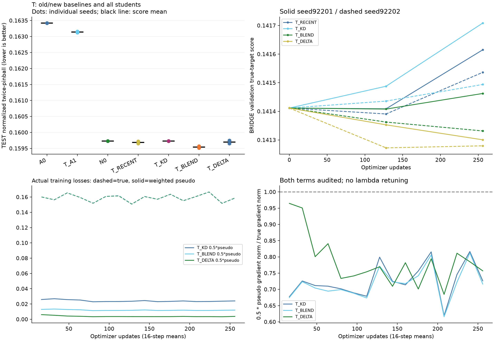

# T REPORT_KO

이번 후보는 ‘OLD 자료 없이 최근 BRIDGE를 사용할 때 옛 적응의 예측 delta가 최근 자료 재학습·일반 증류보다 유용한가’를 Electricity 개발 화면에서 시험했다. V로 선택한 직접 기준선은 seed92201 `T_BLEND`, seed92202 `T_BLEND`이며 후보의 TEST 개선율은 각각 -0.052%, -0.143%, 평균 점수 기준 -0.098%이다. 비용 조건은 teacher-free inference이며 median nMAE 변화는 기준선보다 +0.094%이다(양수는 손해). 새 base 자체의 개선이 주요 효과였고 delta 이전은 최근 자료 학습이나 단순 BLEND보다 추가 가치를 보이지 않았다. 판정은 **NO_GO_CURRENT**이며, 현재 모델 조합과 BRIDGE 조건에서는 delta 이전 후보의 추가 연구를 추천하지 않는다. 신규성·논문 PASS는 판정하지 않았다.

## 전체 비교 결과

점수는 두 seed 점수의 평균이다. 예측 ensemble이 아니다. A0/N0는 고정 pretrained baseline이다.

| Method | Pinball | nMAE | nRMSE | Coverage80 | Width80 | RawCrossing | RawMAE |
| --- | --- | --- | --- | --- | --- | --- | --- |
| A0 | 0.163421 | 0.204764 | 0.306059 | 0.798162 | 0.623488 | 0.000090 | 72.152634 |
| T_A1 | 0.163143 | 0.204383 | 0.305689 | 0.797025 | 0.623819 | 0.000092 | 72.035781 |
| N0 | 0.159731 | 0.199903 | 0.301491 | 0.816446 | 0.635620 | 0.000090 | 70.477320 |
| T_RECENT | 0.159687 | 0.199880 | 0.301730 | 0.810056 | 0.624759 | 0.000120 | 70.481672 |
| T_KD | 0.159731 | 0.199903 | 0.301491 | 0.816446 | 0.635620 | 0.000090 | 70.477320 |
| T_BLEND | 0.159543 | 0.199675 | 0.301091 | 0.813190 | 0.628971 | 0.000081 | 70.386999 |
| T_DELTA | 0.159699 | 0.199862 | 0.301342 | 0.813039 | 0.633792 | 0.000105 | 70.505431 |

주 비교의 paired 14일 block bootstrap 95% CI는 **[-0.201%, +0.025%]**이다. 6시간 간격 TEST 원점 866개를 56개씩 묶어 2,000회 재표집하고 모든 계열·두 seed를 함께 보존했다. overlapping target을 독립 표본으로 세지 않았다. CI는 고정된 두 seed와 계열에 조건부이며 optimizer population과 새 자료 일반화를 보장하지 않는다.

[모든 seed 점수](../scores.csv) · [계열 점수](../series_scores.csv) · [seed별/평균 효과와 CI](../seed_effects.csv) · [자원 표](../resource_table.csv)

## 선택과 구현

V 선택 checkpoint다. Q/T 단위는 update, F는 round이며 0은 학습 전 초기값이다.

| Method | Seed92201 | Seed92202 |
| --- | --- | --- |
| T_A1 | 256 | 256 |
| T_RECENT | 128 | 128 |
| T_KD | 0 | 0 |
| T_BLEND | 128 | 256 |
| T_DELTA | 256 | 128 |

새 프로세스 추론 실측이다. latency는 각 seed 프로세스의 20회 median을 평균했으며 VRAM은 두 seed 중 큰 값이다. Fit seconds는 학습·검증 구간 평균으로 초기화와 별도 감사 비용을 포함한 전체 작업 시간이 아니다.

| Method | Artifact MiB | Batch1 ms | Batch8 ms | Allocated MiB (B8) | Reserved MiB (B8) | Fit seconds |
| --- | --- | --- | --- | --- | --- | --- |
| A0 | 91.03 | 13.30 | 13.13 | 105.66 | 138.00 | N/A |
| T_A1 | 92.18 | 17.06 | 17.76 | 106.79 | 138.00 | 19.92 |
| N0 | 391.60 | 23.81 | 23.97 | 411.90 | 426.00 | N/A |
| T_RECENT | 395.02 | 32.00 | 31.22 | 416.82 | 432.00 | 31.88 |
| T_KD | 395.01 | 32.17 | 33.68 | 416.82 | 432.00 | 52.59 |
| T_BLEND | 395.02 | 32.29 | 33.91 | 416.82 | 432.00 | 52.39 |
| T_DELTA | 395.02 | 32.34 | 32.88 | 416.82 | 432.00 | 52.82 |

사용 조건은 `OLD_DATA_UNAVAILABLE + RECENT_BRIDGE_AVAILABLE`이다. 원래 50% OLD_TRAIN으로 small 교사 두 개를 학습하고 OLD_VAL로 선택했다. base 학생은 별도 프로세스에서 BRIDGE-only 패킷만 읽었으며 전체 원자료 디렉터리 접근을 차단했다. 학생의 실제 context와 target은 BRIDGE 내부이고, sigma metadata는 최초50%에서 고정한 값을 허용했다.

RECENT도 실제 최근 y로 학습했다. KD·BLEND·DELTA는 같은 true loss에 lambda0.5의 pseudo L1을 추가했다. 같은 seed의 A1을 사용했고 교사 ensemble은 없다. 학생 checkpoint에는 base의 q/v LoRA만 있으며 추론에 A0/A1을 호출하지 않는다. label-free/data-free 방법이라고 부르지 않는다.

교사 cache 생성은 총 32,352 example queries / 510 batch calls, 13.05초, 71.09 MiB였다. 입력·모델 revision·matched teacher checkpoint hash를 묶었다. 실제 true/pseudo loss와 각각의 gradient norm은 모든 update의 training.jsonl에 남겼다.

A1 대 A0와 N0 대 A1 비교는 seed_effects.csv의 진단 행에 모두 공개했다. 교사가 새 모델보다 약한 것만으로 delta 이전의 논리적 불가능성을 주장하지 않는다.
T_KD는 두 seed 모두 V에서 step0이 선택되어 TEST 점수가 N0와 같다. 256 updates를 실행했지만 학습된 checkpoint의 V 개선이 없어 초기값을 선택한 결과다.

## 판정 범위와 검산

수치 판정은 `NO_GO_CURRENT`, 최종 해석은 `NO_GO_CURRENT`이다. 검증이 마지막 checkpoint까지 계속 개선하는 경우의 flag는 `False`이며 자동 연장하지 않았다. Trans-LoRA·distillation·task-vector/model merging과 인접하므로 한 데이터·두 seed의 결과를 최초 방법론이나 논문 PASS로 바꾸지 않는다.

학습의 frozen hash는 가중치와 persistent buffer를 포함한다. nonpersistent quantiles metadata의 학습 전후 hash는 수집하지 않았으며 Q 배포 roundtrip의 buffer/공식 예측 검사를 별도 수행했다. [검산 범위](../VERIFICATION.json), [실행 무결성 설명](../../../experiments/tsfm_peft_three_candidate_gonogo_20260922/DECISION_DETAILS.md), [source·cache manifest](../MANIFEST.json)를 함께 확인해야 한다.

GitHub에는 코드·표·그림·hash를 남겼고 raw data, HF weights, checkpoint, 전체 예측 cache는 제외했다. 수치 재생에는 로컬 cache 또는 동일 계약의 재실행이 필요하다. 추가 seed/LR/rank/bit-width/dataset/자동 v2는 실행하지 않는다.
