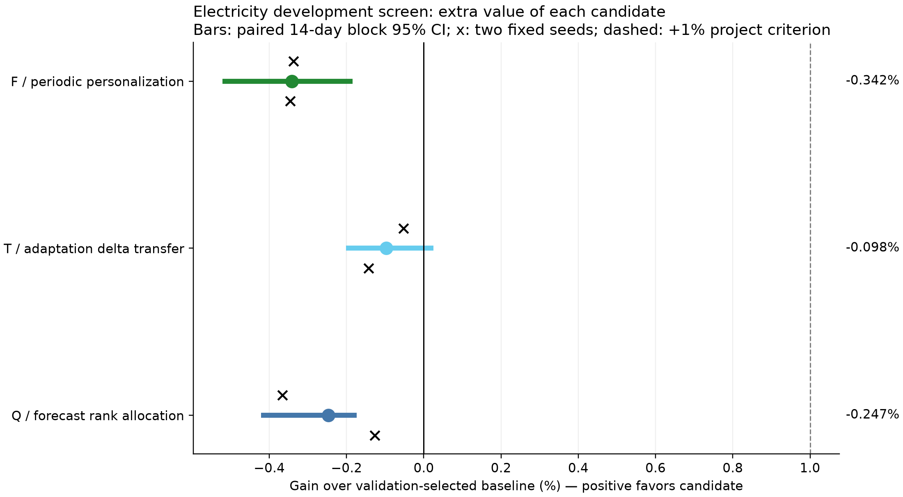

# TSFM PEFT 세 후보 Go / Hold / No-go

실제 학습과 TEST 평가를 마쳤으며 새 후보 세 개 중 GO_SCREEN은 없다. Q는 기존 압축·mixed precision 대안의 실용성을 인정하는 GO_STANDARD_ONLY, T와 F는 현재 후보에 대한 NO_GO_CURRENT다. 세 후보 모두 validation에서 선택한 기준선보다 두 seed에서 불리했다. 후속 확인 추천은 NONE이며 추가 실험 없이 종료한다. 이는 Electricity 개발 자료 하나와 두 seed의 현재 설정에 대한 판단이며 PEFT 전체의 가능성을 반증하지 않는다.

| Candidate | Method | V-selected baseline (seed order) | Mean gain | Seeds | Cost condition | Decision | Novelty |
| --- | --- | --- | --- | --- | --- | --- | --- |
| Q | Q_FORECAST | Q_IO16 / Q_IO16 | -0.247% | -/- | 48.08% BF16 bytes | GO_STANDARD_ONLY | unresolved |
| T | T_DELTA | T_BLEND / T_BLEND | -0.098% | -/- | teacher-free inference | NO_GO_CURRENT | unresolved |
| F | F_PERIODIC | F_LOCAL / F_LOCAL | -0.342% | -/- | 7 private params/client | NO_GO_CURRENT | unresolved |

**다음 확인 추천: NONE**. 추천은 최대 하나이며 새 실험을 자동 실행하지 않는다.

[Q 보고서](Q/REPORT_KO.md) · [T 보고서](T/REPORT_KO.md) · [F 보고서](F/REPORT_KO.md)

모든 비교는 Electricity16개 계열(F4 client), past512/native64, seed92201/92202에서 수행했다. 선택용 seed는 없으며 두 seed 점수를 평균했다. Q3072 + T2560 + F2560 = **main8192**, smoke는 실패1회 포함 **24**, 전체8216 optimizer 호출이다. F_LOCAL의 두 workflow는 각4개 독립 client 모델이므로 중앙 fit10개와 동일한 단위라고 부르지 않는다.

Q/T/F는 독립 후보이며 기존 MAG/HIER/rollout/FR을 재개하거나 기존 학습 checkpoint를 초기값으로 사용하지 않았다. 각 후보 source를 main 전에 봉인하고 V로 checkpoint와 baseline을 선택했다. 34개 TEST prediction을 모두 저장한 다음에만 채점했고, raw scalar metric과 gain을 독립 재계산했다.

F preflight의 PEFT requires_grad 복원 문제는 main 전에 수정했다. 실패 기록을 성공 기록으로 덮지 않았고 실패1 update도 장부에 포함했다. 검산은 동결 persistent state와 저장/복원 및 source/prediction hash 범위이며, nonpersistent metadata의 학습 전후 hash와 원래 fit별 Q 초기화 타이밍은 수집하지 않은 제한을 공개했다.

QERA 계열은 공식 코드 본문의 factor scaling과 다른 **balanced-factor QERA-diag 로컬 변형**이다. 초기 product의 수치 일치만 검증되며, 공식 QERA와 학습 동작이 같다는 뜻은 아니다. 같은 변형을 세 QERA arm에 공통 적용했고 발견 후 재학습하지 않았다. [구현 차이 감사](QERA_FACTOR_BALANCE_AUDIT.json)를 함께 읽어야 한다.

## 결과와 검산 자료

- [Raw/seed scores](scores.csv), [series scores](series_scores.csv), [seed effects / CI](seed_effects.csv)
- [Resource table](resource_table.csv), [F client effects](F_client_effects.csv), [F validation-fixed tail](F_validation_fixed_tail.csv)
- [Selection seal](SELECTIONS.json), [prediction seal](TEST_PREDICTIONS_SEAL.json), [optimizer ledger](OPTIMIZER_LEDGER.json)
- [Verification](VERIFICATION.json), [manifest](MANIFEST.json), [failure/repair](F_SMOKE_FAILURE.json)
- [실행 계약](../../experiments/tsfm_peft_three_candidate_gonogo_20260922/contract/MASTER_PLAN.txt), [고정 세부 규칙](../../experiments/tsfm_peft_three_candidate_gonogo_20260922/PROTOCOL.md), [선행 경계](../../experiments/tsfm_peft_three_candidate_gonogo_20260922/SOURCE_NOTES.md)

이 결과는 공개 개발 자료 하나, 작은 반복 수, 한 모델 계열에 한정된다. GO는 후속 예산 배분 신호일 뿐 신규성·논문 PASS가 아니며, NO_GO는 현재 작은 구현의 판단으로 PEFT 분야 전체를 반증하지 않는다. raw/weights/checkpoints/전체 예측은 로컬 cache에만 있으므로 GitHub 자료만으로 수치 재생이 완결된다고 주장하지 않는다.
